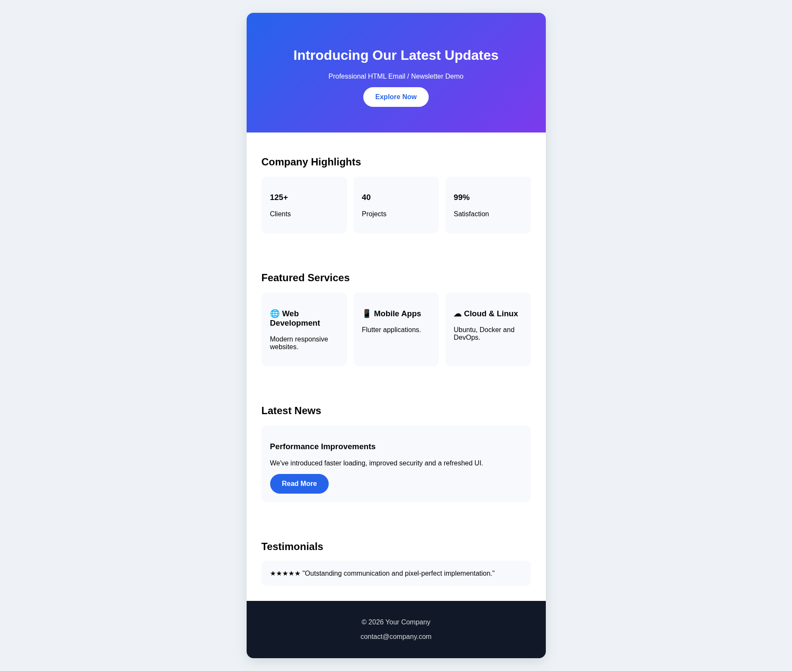

# 📧 Premium HTML Email Newsletter Template

A modern, responsive HTML email newsletter built with clean HTML and CSS.

Designed for:
- Outlook
- Gmail
- Apple Mail
- Yahoo Mail
- Thunderbird

---

## ✨ Features

- ✅ Modern and professional design
- ✅ Fully responsive layout
- ✅ Clean HTML structure
- ✅ Easy to customize
- ✅ Reusable components
- ✅ CTA Buttons
- ✅ Hero Banner
- ✅ Statistics Section
- ✅ Services Section
- ✅ Testimonials
- ✅ Footer with Social Links
- ✅ Lightweight
- ✅ Ready for production

---

## 📁 Project Structure

```
premium-email-template/
│
├── index.html
├── README.md
│

```

---

# 📸 Screenshots

## Desktop Preview



---

## Mobile Preview


---


# 🚀 Technologies

- HTML5
- CSS3
- Responsive Design
- Email-safe Layout

---

# 💻 Compatibility

| Client | Supported |
|----------|-----------|
| Outlook | ✅ |
| Gmail | ✅ |
| Apple Mail | ✅ |
| Yahoo Mail | ✅ |
| Thunderbird | ✅ |

---

# 📦 Installation

Clone the repository

```bash
git clone https://github.com/Rafaaa4/Premium_Newsletter_Template.git
```

Open

```
index.html
```

in your browser.

---

# 📄 License

MIT License

---

# 👨‍💻 Author

**Rafaa**

Web Developer • Flutter Developer • Linux Enthusiast

GitHub:
https://github.com/Rafaaa4
